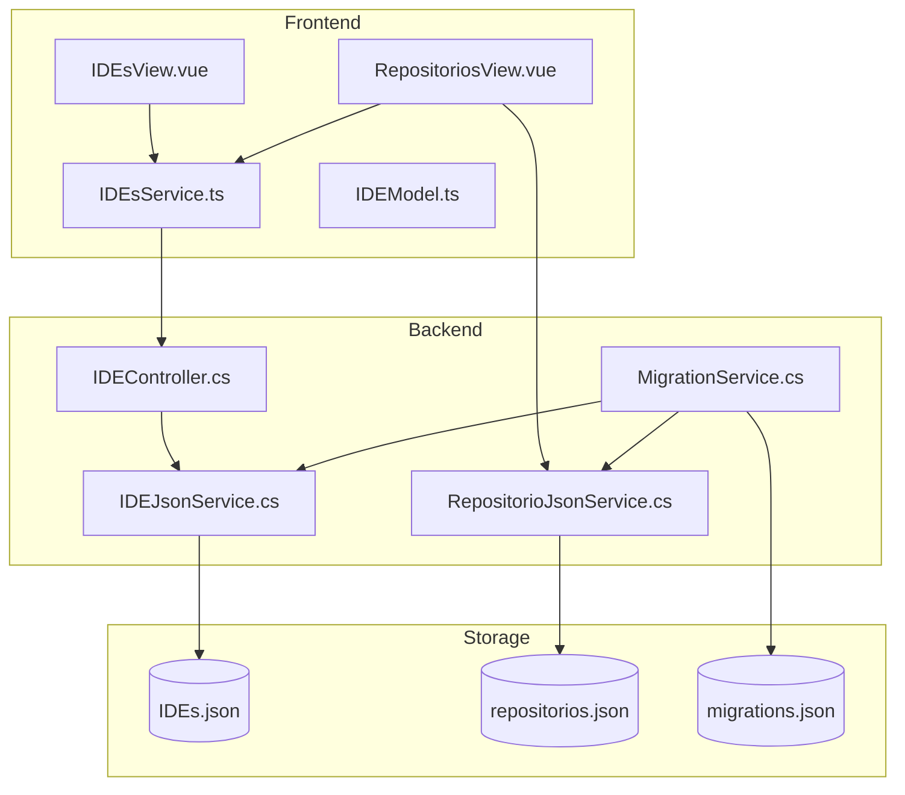

# Documento de Design - Gerenciamento de IDEs

## Visão Geral

Esta funcionalidade adiciona ao ProjectManagerWeb a capacidade de gerenciar múltiplas IDEs (Ambientes de Desenvolvimento Integrado) e associá-las a projetos específicos. O sistema permitirá que desenvolvedores registrem suas IDEs favoritas com comandos personalizados de execução, e configurem projetos para abrir automaticamente na IDE escolhida.

A implementação seguirá os padrões arquiteturais existentes no projeto:
- Backend: .NET 9 com Controllers, Services e DTOs
- Frontend: Vue 3 com Composition API, Vuetify 3 e Pinia
- Persistência: Arquivos JSON em %ProgramData%\PMW\Banco\
- Sistema de Migration para atualização de dados existentes

## Arquitetura

### Diagrama de Componentes



### Fluxo de Dados

1. **Gerenciamento de IDEs**
   - Usuário acessa página de IDEs
   - Frontend carrega lista via IDEsService
   - Backend retorna dados do IDEs.json
   - Usuário cria/edita/exclui IDEs via modal
   - Backend valida e persiste alterações

2. **Associação Projeto-IDE**
   - Usuário edita projeto no cadastro de repositório
   - Frontend exibe dropdown com IDEs disponíveis
   - Usuário seleciona IDE desejada
   - Backend armazena identificador da IDE no projeto
   - Na listagem de pastas, botão exibe "Abrir no {Nome da IDE}"

3. **Migration na Inicialização**
   - Aplicação inicia
   - MigrationService verifica migrations pendentes
   - Executa migration 001_AddIDEs se necessário
   - Cria IDEs padrão (VS Code, Kiro, Delphi)
   - Atualiza projetos existentes para usar VS Code
   - Registra migration como executada

## Componentes e Interfaces

### Backend

#### 1. IDEController.cs
```csharp
[ApiController]
[Route("api/ides")]
public class IDEController(IDEJsonService ideService) : ControllerBase
{
    [HttpGet]
    Task<IActionResult> ConsultarTodos()
    
    [HttpGet("{identificador:guid}")]
    Task<IActionResult> ConsultarPorId(Guid identificador)
    
    [HttpPost]
    Task<IActionResult> Cadastrar([FromBody] IDEDTO ide)
    
    [HttpPut("{identificador:guid}")]
    Task<IActionResult> Atualizar(Guid identificador, [FromBody] IDEDTO ide)
    
    [HttpDelete("{identificador:guid}")]
    Task<IActionResult> Excluir(Guid identificador)
}
```

#### 2. IDEJsonService.cs
```csharp
public class IDEJsonService
{
    private static readonly string FilePath = 
        Path.Combine(BasePath, "IDEs.json");
    private static readonly SemaphoreSlim _semaphore = new(1, 1);
    
    Task<List<IDEDTO>> GetAllAsync()
    Task<IDEDTO?> GetByIdAsync(Guid identificador)
    Task<IDEDTO> AddAsync(IDEDTO novaIDE)
    Task<bool> UpdateAsync(Guid identificador, IDEDTO ideAtualizada)
    Task<bool> DeleteAsync(Guid identificador)
    Task<bool> IsReferencedByProjectsAsync(Guid identificador)
}
```

#### 3. MigrationService.cs
```csharp
public class MigrationService
{
    private static readonly string FilePath = 
        Path.Combine(BasePath, "migrations.json");
    
    Task ExecuteMigrationsAsync()
    Task<bool> IsMigrationExecutedAsync(string migrationName)
    Task RecordMigrationAsync(string migrationName)
    Task Migration_001_AddIDEs()
}
```

#### 4. Atualização em RepositorioJsonService.cs
```csharp
// Adicionar método para buscar IDEs associadas
Task<IDEDTO?> GetIDEForProjectAsync(Guid projetoId)
```

### Frontend

#### 1. IDEsView.vue
```vue
<template>
  <v-container>
    <!-- Lista de cards com IDEs -->
    <v-row>
      <v-col v-for="ide in ides" :key="ide.identificador">
        <v-card>
          <!-- Exibição da IDE -->
        </v-card>
      </v-col>
    </v-row>
    
    <!-- Modal para cadastro/edição -->
    <ModalPadrao v-model="modalAberto">
      <!-- Formulário de IDE -->
    </ModalPadrao>
  </v-container>
</template>
```

#### 2. IDEsService.ts
```typescript
class IDEsService extends BaseApiService {
  async getIDEs(): Promise<IIDE[]>
  async adicionarIDE(ide: IIDE): Promise<void>
  async atualizarIDE(ide: IIDE): Promise<void>
  async excluirIDE(ide: IIDE): Promise<void>
}
```

#### 3. IDEModel.ts
```typescript
export default class IDEModel implements IIDE {
  identificador: string;
  nome: string;
  comandoParaExecutar: string;
  
  constructor(obj: Partial<IIDE> = {})
  toDTO()
}
```

#### 4. Atualização em ProjetoCadastro.vue
```vue
<!-- Substituir checkbox por select de IDE -->
<v-select
  v-model="projeto.comandos.ideIdentificador"
  :items="ides"
  item-title="nome"
  item-value="identificador"
  label="IDE para abrir"
  clearable
/>
```

## Modelos de Dados

### IDEs.json
```json
[
  {
    "identificador": "guid",
    "nome": "VS Code",
    "comandoParaExecutar": "code ."
  },
  {
    "identificador": "guid",
    "nome": "Kiro",
    "comandoParaExecutar": "kiro ."
  },
  {
    "identificador": "guid",
    "nome": "Delphi",
    "comandoParaExecutar": "bds -pDelphi -rBDSERP110203"
  }
]
```

### migrations.json
```json
{
  "executedMigrations": [
    {
      "name": "001_AddIDEs",
      "executedAt": "2024-01-15T10:30:00Z"
    }
  ]
}
```

### Alteração em repositorios.json
```json
{
  "comandos": {
    "instalar": "npm i",
    "iniciar": "npm start",
    "buildar": "npm run build",
    "ideIdentificador": "guid-da-ide"  // Novo campo (substitui abrirNoVSCode)
  }
}
```

### DTOs Backend

#### IDEDTO.cs
```csharp
public sealed record IDEDTO(
    Guid Identificador,
    string Nome,
    string ComandoParaExecutar
);
```

#### MigrationRecordDTO.cs
```csharp
public sealed record MigrationRecordDTO(
    string Name,
    DateTime ExecutedAt
);

public sealed record MigrationsDTO(
    List<MigrationRecordDTO> ExecutedMigrations
);
```

#### Atualização em ComandoDTO.cs
```csharp
public sealed record ComandoDTO(
    string? Instalar,
    string? Iniciar,
    string? Buildar,
    Guid? IDEIdentificador  // Novo campo (substitui AbrirNoVSCode)
);
```

### Interfaces Frontend

#### types/index.ts
```typescript
export interface IIDE {
  identificador: string;
  nome: string;
  comandoParaExecutar: string;
}

export interface IComando {
  instalar?: string | null;
  iniciar?: string | null;
  buildar?: string | null;
  ideIdentificador?: string | null;  // Novo campo
}
```


## Propriedades de Corretude

*Uma propriedade é uma característica ou comportamento que deve ser verdadeiro em todas as execuções válidas de um sistema - essencialmente, uma declaração formal sobre o que o sistema deve fazer. Propriedades servem como a ponte entre especificações legíveis por humanos e garantias de corretude verificáveis por máquina.*

### Propriedade 1: Persistência de criação de IDE
*Para qualquer* IDE válida com nome e comando não vazios, quando criada via API, a leitura subsequente deve retornar uma IDE com os mesmos valores de nome e comando.
**Valida: Requisito 1.1**

### Propriedade 2: Preservação de identificador na atualização
*Para qualquer* IDE existente, quando atualizada com novos dados, o identificador deve permanecer inalterado.
**Valida: Requisito 1.2**

### Propriedade 3: Remoção efetiva de IDE
*Para qualquer* IDE existente, quando excluída, ela não deve mais aparecer na listagem de IDEs.
**Valida: Requisito 1.3**

### Propriedade 4: Completude da listagem
*Para qualquer* conjunto de N IDEs criadas, a listagem deve retornar exatamente N IDEs.
**Valida: Requisito 1.4**

### Propriedade 5: Idempotência da migration
*Para qualquer* estado inicial do sistema, executar a migration múltiplas vezes deve produzir o mesmo resultado que executar uma única vez.
**Valida: Requisito 2.2**

### Propriedade 6: Preservação de dados na migration
*Para qualquer* repositório existente com dados aleatórios, após executar a migration, todos os campos exceto o campo de IDE devem permanecer inalterados.
**Valida: Requisito 2.3**

### Propriedade 7: Persistência de associação projeto-IDE
*Para qualquer* projeto e IDE válidos, quando o projeto é salvo com a IDE associada, a leitura subsequente deve retornar o identificador correto da IDE.
**Valida: Requisito 3.2**

### Propriedade 8: Renderização correta do nome da IDE
*Para qualquer* projeto com IDE associada, o texto de exibição deve conter o nome exato da IDE selecionada.
**Valida: Requisito 3.4**

### Propriedade 9: Pré-preenchimento correto no modal de edição
*Para qualquer* IDE existente, quando o modal de edição é aberto, os campos devem conter os valores atuais da IDE.
**Valida: Requisito 4.3**

### Propriedade 10: Validação de campos obrigatórios
*Para qualquer* string composta apenas de whitespace ou vazia, o sistema deve rejeitar a criação/atualização de IDE com esse valor em nome ou comando.
**Valida: Requisito 4.4**

### Propriedade 11: Registro de migration bem-sucedida
*Para qualquer* migration executada com sucesso, o sistema deve registrar a migration no arquivo migrations.json para prevenir re-execução.
**Valida: Requisito 5.4**

### Propriedade 12: Integridade referencial na exclusão
*Para qualquer* IDE que está associada a pelo menos um projeto, a tentativa de exclusão deve ser bloqueada e retornar erro.
**Valida: Requisito 6.1**

### Propriedade 13: Atualização em cascata de nomes
*Para qualquer* IDE renomeada, todos os projetos que a referenciam devem exibir o novo nome imediatamente.
**Valida: Requisito 6.3**

### Propriedade 14: Inclusão de dados completos da IDE
*Para qualquer* projeto recuperado via API que possui IDE associada, a resposta deve incluir nome e comando da IDE, não apenas o identificador.
**Valida: Requisito 6.4**

### Propriedade 15: Validação de identificadores de IDE
*Para qualquer* identificador de IDE inexistente, a tentativa de associá-lo a um projeto deve ser rejeitada pelo sistema.
**Valida: Requisito 6.5**

## Tratamento de Erros

### Backend

1. **Validação de Entrada**
   - Campos obrigatórios vazios: retornar 400 Bad Request
   - GUID inválido: retornar 400 Bad Request
   - IDE não encontrada: retornar 404 Not Found

2. **Integridade Referencial**
   - Exclusão de IDE em uso: retornar 409 Conflict com mensagem descritiva
   - Associação com IDE inexistente: retornar 400 Bad Request

3. **Operações de Arquivo**
   - Falha ao ler arquivo: retornar lista vazia e logar erro
   - Falha ao escrever arquivo: retornar 500 Internal Server Error
   - Arquivo corrompido: retornar 500 Internal Server Error e logar

4. **Migration**
   - Falha na migration: logar erro detalhado e continuar inicialização
   - Migration parcialmente executada: implementar rollback ou idempotência

### Frontend

1. **Validação de Formulário**
   - Campos obrigatórios: exibir mensagem de erro inline
   - Formato inválido: prevenir submissão

2. **Erros de API**
   - 400/404: exibir notificação com mensagem do backend
   - 409: exibir modal explicativo sobre IDE em uso
   - 500: exibir mensagem genérica de erro

3. **Estados de Carregamento**
   - Requisições em andamento: exibir loading spinner
   - Timeout: exibir mensagem de timeout e opção de retry

4. **Dados Órfãos**
   - IDE não encontrada: exibir "IDE não configurada" ou similar
   - Falha ao carregar IDEs: desabilitar seleção e exibir mensagem

## Estratégia de Testes

### Testes Unitários

#### Backend
1. **IDEJsonService**
   - Criar IDE com dados válidos
   - Atualizar IDE existente
   - Excluir IDE não referenciada
   - Verificar integridade referencial
   - Listar todas as IDEs

2. **MigrationService**
   - Executar migration em banco vazio
   - Executar migration em banco com dados
   - Verificar idempotência
   - Testar rollback em caso de falha

3. **IDEController**
   - Validação de entrada
   - Tratamento de erros
   - Respostas HTTP corretas

#### Frontend
1. **IDEsService**
   - Chamadas de API corretas
   - Transformação de DTOs
   - Tratamento de erros

2. **IDEModel**
   - Construção com dados parciais
   - Conversão para DTO
   - Validação de campos

3. **Componentes**
   - Renderização de lista de IDEs
   - Abertura/fechamento de modal
   - Validação de formulário
   - Submissão de dados

### Testes Baseados em Propriedades

Utilizaremos **xUnit com FsCheck** para .NET e **Vitest com fast-check** para TypeScript.

#### Configuração
- Cada teste de propriedade deve executar no mínimo 100 iterações
- Cada teste deve referenciar explicitamente a propriedade do design
- Formato do comentário: `**Feature: ide-management, Property {número}: {texto da propriedade}**`

#### Propriedades a Testar

1. **Property 1: Persistência de criação**
   - Gerar IDEs aleatórias
   - Criar via service
   - Verificar leitura retorna mesmos dados

2. **Property 2: Preservação de identificador**
   - Gerar IDE e atualização aleatórias
   - Verificar identificador não muda

3. **Property 5: Idempotência de migration**
   - Executar migration N vezes
   - Verificar resultado idêntico

4. **Property 6: Preservação de dados**
   - Gerar repositórios aleatórios
   - Executar migration
   - Verificar apenas campo IDE mudou

5. **Property 7: Persistência de associação**
   - Gerar projeto e IDE aleatórios
   - Associar e salvar
   - Verificar leitura retorna associação

6. **Property 10: Validação de campos**
   - Gerar strings inválidas (vazias, whitespace)
   - Verificar rejeição

7. **Property 12: Integridade referencial**
   - Criar projeto com IDE
   - Tentar excluir IDE
   - Verificar bloqueio

8. **Property 15: Validação de identificadores**
   - Gerar GUIDs inexistentes
   - Tentar associar a projeto
   - Verificar rejeição

### Testes de Integração

1. **Fluxo Completo de CRUD**
   - Criar IDE via API
   - Listar e verificar presença
   - Atualizar e verificar mudanças
   - Excluir e verificar remoção

2. **Fluxo de Migration**
   - Iniciar aplicação em banco vazio
   - Verificar criação de IDEs padrão
   - Reiniciar e verificar não duplicação

3. **Fluxo de Associação**
   - Criar IDE
   - Criar repositório com projeto
   - Associar IDE ao projeto
   - Verificar exibição correta na UI

## Considerações de Implementação

### Performance

1. **Cache de IDEs**
   - IDEs são dados relativamente estáticos
   - Considerar cache em memória no backend
   - Invalidar cache em operações de escrita

2. **Carregamento de IDEs no Frontend**
   - Carregar lista de IDEs uma vez na inicialização
   - Armazenar em Pinia store para acesso global
   - Atualizar store após operações CRUD

### Segurança

1. **Validação de Comandos**
   - Não executar validação de comandos no backend (confiamos no usuário)
   - Comandos são executados via ShellExecute existente
   - Usuário é responsável por comandos seguros

2. **Sanitização de Entrada**
   - Validar formato de GUID
   - Limitar tamanho de strings (nome: 100 chars, comando: 500 chars)
   - Prevenir injeção via caracteres especiais em JSON

### Compatibilidade

1. **Migração de Dados Existentes**
   - Campo `abrirNoVSCode: boolean` será substituído por `ideIdentificador: Guid?`
   - Migration converterá `true` para GUID do VS Code
   - Migration converterá `false` para `null`

2. **Rollback**
   - Não implementaremos rollback automático
   - Backup manual recomendado antes de atualização
   - Migration é idempotente para permitir re-execução

### Extensibilidade

1. **Novos Campos em IDE**
   - Estrutura permite adicionar campos futuros (ícone, cor, etc.)
   - DTOs podem ser estendidos sem quebrar compatibilidade

2. **Múltiplas IDEs por Projeto**
   - Arquitetura atual suporta apenas uma IDE por projeto
   - Futura extensão para múltiplas IDEs requer mudança de `Guid?` para `List<Guid>`

## Dependências

### Backend
- .NET 9 SDK
- System.Text.Json (built-in)
- xUnit (testes)
- FsCheck.Xunit (property-based testing)

### Frontend
- Vue 3
- Vuetify 3
- Axios
- Pinia
- Vitest (testes)
- fast-check (property-based testing)

## Cronograma de Implementação

A implementação seguirá a ordem definida no documento de tarefas (tasks.md), priorizando:

1. Backend primeiro (CRUD + Migration)
2. Testes de backend
3. Frontend (UI + Service)
4. Testes de frontend
5. Integração e testes end-to-end
6. Ajustes finais e documentação
